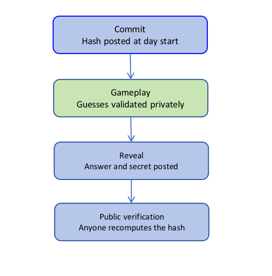

# LINGO — Technical Architechture & Tech Stack
## 1. Tech Stack Decision and Rationale

Because Hive uses a fee-less transaction model, players submit and sign their own guesses through their Hive accounts using Resource Credits (RC). As a result, the project's ongoing expenses are mostly limited to hosting and a small amount of RC for the application's own blockchain transactions.

- **Wallet authentication:** the Aioha library is used to integrate Hive Keychain. This avoids developing a custom login system while also making it easier to support HiveAuth for mobile users in the future if needed.
- **Hive blockchain:** Communication is handled through `@hiveio/dhive` using public Hive API nodes such as `api.hive.blog`. This avoids running a dedicated Hive node and reduces infrastructure costs. dhive is widely used in the Hive ecosystem and would integrate naturally with Node.js applications.
- **Hive-Engine integration:** the `sscjs` library communicates with public Hive-Engine nodes. Relies on existing public infrastructure instead of maintaining separate services which may include greater cost.

## Hosting

- **Frontend:** React with Vite is the preferred choice, with deployment on Vercel using their free hosting tiers. Since the interface is a static web application, this setup provides fast performance while avoiding server maintenance costs.
- **Backend:** The backend uses Node.js with Express (JavaScript). It handles core game logic including daily puzzle generation, commit hash creation, guess validation before reveal, leaderboard indexing from Hive blockchain data, and scheduled reward distribution. The Hive blockchain remains the source of truth, while the backend acts as a coordination and indexing layer.
- **Scheduled tasks:** daily commits, daily reveals, and weekly reward distributions can be handled through GitHub Actions scheduled workflows. Since these tasks only run periodically, there is no need to keep a server running continuously, which helps keep hosting costs low.
- **Database:** PostgreSQL, hosted through Supabase or Neon on their free tiers. Would be used to store: puzzle metadata, cached blockchain data, player statistics, and leaderboard information. Considering approx. 500 players daily (theoretical player count for the initial release), database usage should remain comfortably within free-tier limits.

Overall, the estimated operating cost is **approximately $1–6 per month**, with most of the expense coming from an optional custom domain. This leaves enough room within the project's target budget while allowing the application to scale gradually as the user base grows.

> **Hosting Consideration:** The proposed infrastructure is intended for an MVP. Additional hosting and infrastructure costs should be expected depending on the scale of expected playing base. This is considered a future scaling issue rather than an immediate concern.

| Layer | Decision | Rationale |
|---|---|---|
| Frontend | React (Vite) hosted on Vercel (free tier) | Static SPA, free hosting, no server needed |
| Backend | Node.js + Express (JavaScript) | Simple full-stack JS, handles game logic + scheduling |
| Scheduled tasks | GitHub Actions | Lightweight periodic jobs, no always-on server |
| Database | PostgreSQL (Supabase or Neon, free tier) | Reliable multi-user DB |
| Wallet Login | Aioha (Hive Keychain integration) | Reuses existing Hive login, no custom auth needed |
| Hive Blockchain | `@hiveio/dhive` via public Hive API nodes | Avoids running full node, uses free public infrastructure |
| Hive-Engine Integration | sscjs using public Hive-Engine nodes | No backend infrastructure required for token interaction |

---

## 2. Commit-Reveal System Design

The commit-reveal system ensures that the daily puzzle cannot be changed after the game begins while keeping the answer hidden until the end of the day. The process is divided into four stages: commit, guess validation, reveal, and public verification.

*Blue = on-chain step; Green = private backend-only step*

### 1. Daily On-Chain Commit

- At the start of each day, the application broadcasts a `lingo_commit` custom_json transaction using the app account's posting key.
- The transaction includes the puzzle date, puzzle number, word length, and a SHA-256 hash generated from the date, answer, and a randomly generated secret.
- Only the hash is published on-chain, so the correct answer remains hidden during gameplay while proving that it was predetermined before players started guessing.

### 2. Private Guess Validation

- The correct answer is stored securely in the PostgreSQL database until the puzzle ends and is not exposed to the frontend.
- When a player submits a guess, the backend compares it with the stored answer and returns Wordle-style feedback indicating correct, present, or absent letters.
- After validation, the player's guess is recorded on-chain through a `lingo_guess` custom_json transaction signed with Hive Keychain, creating a permanent public record of gameplay.

### 3. End-of-Day Reveal

- At the end of the puzzle period, the application broadcasts a `lingo_reveal` custom_json transaction using the app account's posting key.
- The reveal transaction contains the puzzle date, the correct answer, and the secret used when generating the original hash.
- Publishing these values allows anyone to verify that the answer matches the commitment made at the start of the day.

### 4. Public Verification

- Anyone can retrieve the day's `lingo_commit` and `lingo_reveal` transactions directly from the Hive blockchain.
- Using the published formula `SHA256(date | answer | secret)`, they can recompute the hash locally and compare it with the committed hash.
- A matching hash confirms that the puzzle answer was not changed after gameplay began. Because player guesses are also stored on-chain, leaderboard results can be independently checked using the published scoring rules.

### 5. Automation

- The daily commit and end-of-day reveal are executed automatically using GitHub Actions scheduled workflows.
- These operations run only at scheduled times, so no continuously running server is required for the automation process.
- All scheduling uses UTC to ensure consistent puzzle start and end times for players in different time zones.

| Phase | Who Broadcasts | Key Used | Purpose |
|---|---|---|---|
| Commit | App account | Posting key | Publishes the daily puzzle hash before gameplay begins. |
| Guess (repeat per attempt) | Player, via Keychain | Player posting key | Records each guess on-chain after backend validation. |
| Reveal | App account | Posting key | Publishes the answer and secret for public verification. |

---

## 3. Hive Integration Design

The application integrates with the Hive blockchain in three key areas: recording player guesses, authenticating users, and allowing players to share their results directly on Hive.

### 1. Guesses as custom_json

- Each player guess is recorded as a separate custom_json transaction (`lingo_guess`) and is broadcast directly from the player's Hive account using Hive Keychain.
- The transaction is signed with the posting key, as submitting a guess is not a financial operation and does not require the more sensitive active key.
- Before the transaction is broadcast, the backend validates the guess against the stored daily answer and returns Wordle-style feedback to the player.
- Once validated, the guess is permanently recorded on the Hive blockchain, creating a transparent and publicly verifiable game history.

### 2. Hive Keychain Login

- User authentication is handled through Hive Keychain using a challenge-response signature rather than a blockchain transaction.
- The backend generates a unique challenge, which the player signs using their posting key through Keychain.
- The signed response is verified using the player's public posting key stored on the Hive blockchain.
- Once verified, the backend creates a user session and logs the player into the application.
- Since no blockchain transaction is created during login, the process consumes no Resource Credits (RC) and the user's private keys never leave the Keychain extension.

### 3. One-Click Share as Hive Post

- Players can share their daily results directly to Hive using Hive Keychain.
- The shared post includes an emoji-style result grid, the number of attempts, and the player's current streak, without revealing the correct answer.
- The post is signed using the player's posting key before being published to their Hive blog.
- Using a spoiler-free sharing format encourages community engagement while allowing other players to complete the daily puzzle without seeing the answer.

| Feature | Hive Operation | Authentication |
|---|---|---|
| Player Guess | custom_json (`lingo_guess`) | Posting key via Hive Keychain |
| Login | Challenge-response signature | Posting key via Hive Keychain |
| Share Results | Hive comment (post) | Posting key via Hive Keychain |