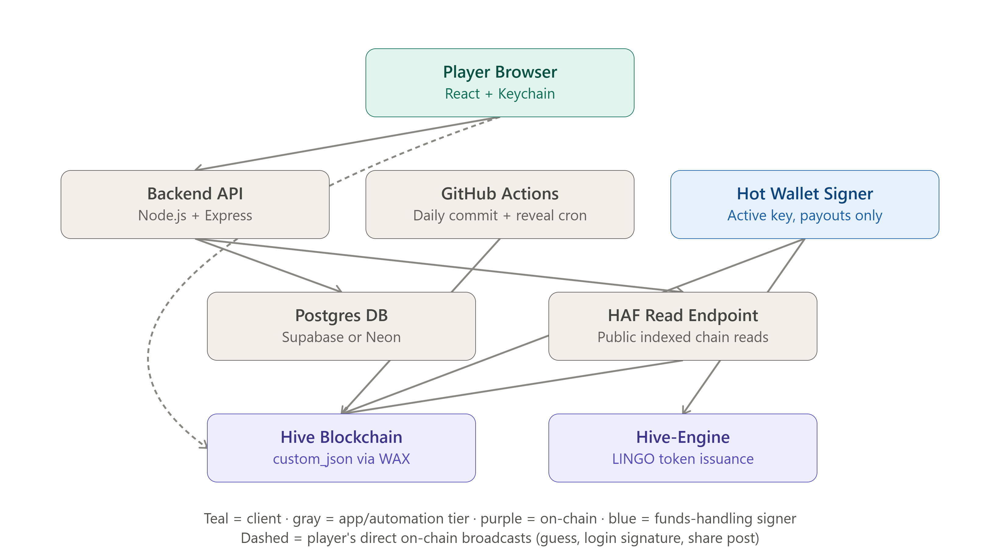

# LINGO — Technical Architechture & Tech Stack
## Tech Stack Decision and Rationale

Because Hive uses a fee-less transaction model, players submit and sign their own guesses through their Hive accounts using Resource Credits (RC). As a result, the project's ongoing expenses are mostly limited to hosting and a small amount of RC for the application's own blockchain transactions.

- **Wallet authentication:** the Aioha library is used to integrate Hive Keychain. This avoids developing a custom login system while also making it easier to support HiveAuth for mobile users in the future if needed.
- **Hive blockchain:** Communication is handled through @hiveio/wax, Hive's official TypeScript/WASM library, using public Hive API nodes. WAX is the preferred library for building and signing Hive transactions while avoiding the need to operate a dedicated Hive node, helping keep infrastructure costs low.
- **Blockchain data indexing:** Leaderboard and gameplay data are retrieved through HAF (Hive Application Framework) using a public HAF-backed endpoint (such as HAfAH). Since HAF stores blockchain data in PostgreSQL, it integrates naturally with the project's database while avoiding manual blockchain scanning.
- **Hive-Engine integration:** the sscjs library communicates with public Hive-Engine nodes. Relies on existing public infrastructure instead of maintaining separate services which may include greater cost.

**Hosting:**

- **Frontend:** React with Vite is the preferred choice, with deployment on Vercel using their free hosting tiers. Since the interface is a static web application, this setup provides fast performance while avoiding server maintenance costs.
- **Backend:** The backend uses Node.js with Express (JavaScript). It handles core game logic including daily puzzle generation, commit hash creation, guess validation before reveal, leaderboard indexing through HAF-backed APIs (leaderboard data is indexed from Hive using a public HAF-backed endpoint rather than scanning blockchain blocks manually), and scheduled reward distribution. The Hive blockchain remains the source of truth, while the backend acts as a coordination and indexing layer.
- **Scheduled tasks:** daily commits, daily reveals, and weekly reward distributions can be handled through GitHub Actions scheduled workflows. Since these tasks only run periodically, there is no need to keep a server running continuously, which helps keep hosting costs low.
- **Database:** PostgreSQL, hosted through Supabase or Neon on their free tiers. Would be used to store: puzzle metadata, cached blockchain data, player statistics, and leaderboard information. Considering approx. 500 players daily (theoretical player count for the initial release), database usage should remain comfortably within free-tier limits.

Overall, the estimated operating cost is **approximately $1–6 per month**, with most of the expense coming from an optional custom domain. This leaves enough room within the project's target budget while allowing the application to scale gradually as the user base grows.

> **Note:** Daily puzzles are selected from a curated PostgreSQL word database containing predefined words and metadata such as difficulty, category, theme, and word length. The initial dataset can be based on an existing open-source Wordle word list and extended with Hive-specific terminology to support future gameplay features.

> **Hosting Consideration:** The proposed infrastructure is intended for an MVP. Additional hosting and infrastructure costs should be expected depending on the scale of expected playing base. This is considered a future scaling issue rather than an immediate concern.

| Layer | Decision | Rationale |
|---|---|---|
| Frontend | React (Vite) hosted on Vercel (free tier) | Static SPA, free hosting, no server needed |
| Backend | Node.js + Express (JavaScript) | Simple full-stack JS, handles game logic + scheduling |
| Scheduled tasks | GitHub Actions | Lightweight periodic jobs, no always-on server |
| Database | PostgreSQL (Supabase or Neon, free tier) | Reliable multi-user DB |
| Wallet Login | Aioha (Hive Keychain integration) | Reuses existing Hive login, no custom auth needed |
| Hive Blockchain | `@hiveio/wax` via public Hive API nodes | Official Hive library for building and signing transactions|
| Blockchain Indexing | HAF / HAF-backed API | Efficient PostgreSQL-based blockchain queries |
| Hive-Engine Integration | sscjs using public Hive-Engine nodes | No backend infrastructure required for token interaction |

---

## Commit-Reveal System Design

The commit-reveal system ensures that the daily puzzle cannot be changed after the game begins while keeping the answer hidden until the end of the day. The process is divided into four stages: commit, guess validation, reveal, and public verification. Transactions are built using WAX before being signed and broadcast.

### Daily On-Chain Commit

- At the start of each day, the application broadcasts a lingo_commit custom_json transaction using the app account's posting key.
- The transaction includes the puzzle date, puzzle number, word length, and a SHA-256 hash generated from the date, answer, and a randomly generated secret.
- Only the hash is published on-chain, so the correct answer remains hidden during gameplay while proving that it was predetermined before players started guessing.
- The transaction is built and signed using WAX before being broadcast to the Hive blockchain.

### Private Guess Validation

- The correct answer is stored securely in the PostgreSQL database until the puzzle ends and is not exposed to the frontend.
- When a player submits a guess, the backend compares it with the stored answer and returns Wordle-style feedback indicating correct, present, or absent letters.
- Before comparing the guess to the correct answer, the backend also verifies that it exists in the application's approved word list, preventing invalid or non-dictionary words from being accepted.
- After validation, the player's guess is recorded on-chain through a lingo_guess custom_json transaction signed with Hive Keychain, creating a permanent public record of gameplay.

### End-of-Day Reveal

- At the end of the puzzle period, the application broadcasts a lingo_reveal custom_json transaction using the app account's posting key.
- The reveal transaction contains the puzzle date, the correct answer, and the secret used when generating the original hash.
- Publishing these values allows anyone to verify that the answer matches the commitment made at the start of the day.

### Public Verification

- Anyone can retrieve the day's lingo_commit and lingo_reveal transactions from the Hive blockchain using a HAF-backed endpoint, then recompute the published hash locally to verify that the committed puzzle matches the revealed answer.
- Using the published formula `SHA256(date | answer | secret)`, they can recompute the hash locally and compare it with the committed hash.
- A matching hash confirms that the puzzle answer was not changed after gameplay began. Because player guesses are also stored on-chain, leaderboard results can be independently checked using the published scoring rules.

### Automation

- The daily commit and end-of-day reveal are executed automatically using GitHub Actions scheduled workflows.
- These operations run only at scheduled times, so no continuously running server is required for the automation process.
- All scheduling uses UTC to ensure consistent puzzle start and end times for players in different time zones.

*Blue = on-chain step; Green = private backend-only step*

| Phase | Who Broadcasts | Key Used | Purpose |
|---|---|---|---|
| Commit | App account | Posting key | Publishes the daily puzzle hash before gameplay begins. |
| Guess (repeat per attempt) | Player, via Keychain | Player posting key | Records each guess on-chain after backend validation. |
| Reveal | App account | Posting key | Publishes the answer and secret for public verification. |

---

## Hive Integration Design

The application integrates with the Hive blockchain in three key areas: recording player guesses, authenticating users, and allowing players to share their results directly on Hive.

### Guesses as custom_json

- Each player guess is recorded as a separate custom_json transaction (lingo_guess) and is broadcast directly from the player's Hive account using Hive Keychain.
- The custom_json transaction is built using WAX and signed by the player through Hive Keychain before being broadcast to the Hive blockchain.
- The transaction is signed with the posting key, as submitting a guess is not a financial operation and does not require the more sensitive active key.
- Before the transaction is broadcast, the backend validates the guess against the stored daily answer and returns Wordle-style feedback to the player.
- Once validated, the guess is permanently recorded on the Hive blockchain, creating a transparent and publicly verifiable game history.
- Leaderboard and gameplay data are later retrieved through HAF-backed APIs, allowing efficient indexing of lingo_guess transactions without manually scanning blockchain blocks.

### Hive Keychain Login

- User authentication is handled through Hive Keychain using a challenge-response signature rather than a blockchain transaction.
- The backend generates a unique challenge, which the player signs using their posting key through Keychain.
- The signed response is verified using the player's public posting key stored on the Hive blockchain.
- Once verified, the backend creates a user session and logs the player into the application.
- Since no blockchain transaction is created during login, the process consumes no Resource Credits (RC) and the user's private keys never leave the Keychain extension.

### One-Click Share as Hive Post

- Players can share their daily results directly to Hive using Hive Keychain.
- The shared post includes an emoji-style result grid, the number of attempts, and the player's current streak, without revealing the correct answer.
- The post is signed using the player's posting key before being published to their Hive blog.
- Using a spoiler-free sharing format encourages community engagement while allowing other players to complete the daily puzzle without seeing the answer.

| Feature | Hive Operation | Authentication |
|---|---|---|
| Player Guess | custom_json (`lingo_guess`) | Posting key via Hive Keychain |
| Login | Challenge-response signature | Posting key via Hive Keychain |
| Share Results | Hive comment (post) | Posting key via Hive Keychain |

## Reward / Payout Engine Design

The payout engine computes two independent reward streams: a weekly HBD pool and a daily LINGO token issuance, both triggered automatically.

> **Note:** The MVP uses a fixed six-guess limit.

### Weekly HBD Pool

- A player qualifies for a share of the weekly HBD pool by solving at least 5 of that week's 7 puzzles. The week runs Monday 00:00 UTC through Sunday 23:59:59 UTC, aligned with the same UTC boundary used for daily puzzle resets.
- Players below the 5/7 threshold receive no HBD share that week. This does not affect their LINGO earnings or streak, which are tracked independently.

### Multipliers

- Three multipliers apply to a qualifying player's base pool share:
  - 2x for finishing among that day's ten fastest solvers
  - 1.5x for a perfect 7/7 week
  - 1.25x for reaching four or more consecutive qualifying weeks
- Multipliers stack additively: `base_share × (1 + bonus_1 + bonus_2 + bonus_3)`, so a player hitting all three earns `base × 2.75`.
- Additive stacking was chosen over multiplicative because it keeps payouts linear and easy for any player to verify by hand against the published rules, and avoids unpredictable compounding if further multipliers are added later.

### Fastest-Solver Timing

- Start time is the server-recorded timestamp of a player's first guess that day, end time is the server-recorded timestamp of their correct guess.
- The timer runs continuously with no pause or resume, and both timestamps are captured entirely server-side, never from client-reported time.
- The ten fastest solvers each day are those with the lowest elapsed time among all players who solved that day.
- If two or more players record the same elapsed time, the player whose correct guess was validated first by the backend receives the higher ranking.

### Daily LINGO Token Issuance

- A fixed daily pool of approximately 500 LINGO tokens is issued once per calendar day (UTC) to that day's successful solvers, tied to the one-attempt-per-account rule.
- Tokens are issued through the Hive-Engine "issue" contract action from the app's token-issuer account.
- The exact per-solve split of the 500-token pool, and the token's broader Hive-Engine liquidity mechanism, remain open pending confirmation with the product design track.

### Automated Payouts and Key Security

- Weekly HBD payouts and daily LINGO issuance run through GitHub Actions scheduled workflows.
- Because HBD transfers require the app account's active key, this key is never stored in a GitHub Actions secret.
- Instead, payouts are signed by a dedicated hot wallet holding only the funds needed for the current payout cycle, kept separate from the app's main posting-key-controlled account.

## Anti-Cheat & Fairness Design

- The correct answer is never sent to the frontend before the daily reveal. All guess comparisons are performed server-side, consistent with the commit-reveal design.
- Since players broadcast their own lingo_guess transactions directly through Hive Keychain, the leaderboard and reward calculations rely only on the backend's validation records, rather than on results obtained by independently scanning on-chain guesses. This prevents players from fabricating an on-chain "correct guess" without first going through the actual backend validation process.
- Solve timing for the Fastest Solver ranking is captured entirely server-side, using the timestamp of each guess request. Client-reported timestamps are never used, preventing players from manipulating their completion times.
- Each account may register only one qualifying solve per puzzle per day. This rule is enforced by the backend during validation, regardless of how many lingo_guess transactions a player broadcasts afterward.
- New or low-RC accounts that cannot yet broadcast their own lingo_guess transaction are supported through a Resource Credit (RC) delegation from the application's account. This ensures gameplay is not blocked by a player's available RC balance.

## Data Model, API Endpoints, and Architecture

### Schema

**users** (hive_username, current_streak, longest_streak, consecutive_qualifying_weeks, total_lingo_earned)

**daily_puzzles** (puzzle_date, puzzle_number, word_length, answer, secret, commit_hash, commit_tx_id, reveal_tx_id, status)

**guesses** (id, hive_username, puzzle_date, attempt_number, guess_word, submitted_at, validation_result, tx_id)

**solves** (id, hive_username, puzzle_date, solved_at, elapsed_seconds, attempt_count, fastest_10_rank)

**streaks** (hive_username, current_streak, longest_streak, last_solved_date)

**weekly_pools** (week_start_date, total_hbd_pool, total_qualifying_players, status)

**payouts** (id, hive_username, week_start_date, base_share, multipliers_applied, final_amount_hbd, payout_tx_id, paid_at)

**tokens** (id, hive_username, puzzle_date, amount_issued, issue_tx_id, issued_at).

### Main API Endpoints

- POST /api/guess (submit and validate a guess)
- GET /api/puzzle/today (puzzle metadata only, never the answer)
- GET /api/leaderboard/daily
- GET /api/leaderboard/weekly
- GET /api/player/:username/stats
- POST /api/auth/challenge
- POST /api/auth/verify
- GET /api/verify/:date (public commit/reveal data for independent verification)

Commit, reveal, and payout triggers are internal endpoints called only by scheduled GitHub Actions workflows, not exposed to players.

### Architecture

- The player's browser talks to the backend API for guess validation and login, and talks directly to the Hive blockchain via Keychain for guess broadcasts, login signatures, and shared posts.
- The backend reads and writes Postgres for app state, and reads a HAF-backed public endpoint for indexed leaderboard data rather than scanning blocks manually.
- GitHub Actions broadcasts the daily commit and reveal using WAX. A separate hot wallet signer, holding only the active key, handles HBD payouts and LINGO issuance.

## Prize-Pool Account, Funding Integrations, and Non-Functional Requirements

- A dedicated, publicly viewable Hive account holds the prize pool's HBD balance, separate from the app's operational account, so the pool balance can be audited directly on-chain without relying on internal reporting.
- Incoming funds are deposited via standard Hive transfers, which are inherently transparent and timestamped.
- Outgoing weekly payouts are signed by the hot wallet described above, which holds only the current cycle's funds rather than the full pool balance, limiting exposure if that key were ever compromised.
- A payouts ledger reconciles what the backend has recorded as paid against actual on-chain transfer history.

### Funding Integrations (Future, Not Committed)

- DHF grant milestones, sponsor contributions, and NFT sale proceeds would all route into the prize-pool account the same way: as ordinary Hive transfers, requiring no special integration beyond the account already existing publicly.
- None of these are treated as committed funding in this architecture; the prize-pool account and payout engine accept funds from any of them without requiring structural changes later.
- A hint-token burn/split, where a portion of LINGO spent on hints is burned or routed to the prize pool, is a secondary funding mechanism worth designing once the hint feature itself is built.

### Non-Functional Needs

- **Security:** security of funds rests on isolating the hot wallet's active key from the main app account and from GitHub Actions secrets, funded only per payout cycle.
- **Scalability:** current free-tier hosting is sufficient at MVP scale, with further scaling treated as a future concern rather than an MVP requirement.
- **Environments/CI:** separate development and production environments (ideally using Hive's testnet for development, mainnet for production), with separate app accounts and database instances for each, so testing reward-rule changes never risks real HBD or a live puzzle.

## Implementation Roadmap

**Phase 1 — Foundation:** Tech stack setup, repo scaffolding, Hive testnet accounts, WAX + Aioha integration, basic Keychain login. No blocking dependencies.

**Phase 2 — Core Game Loop:** Commit-reveal implementation, guess submission and private validation, lingo_guess broadcasting. Depends on the product rules defined in the Product Specification.

**Phase 3 — Indexing & Leaderboard:** HAF-backed read integration, daily/weekly leaderboard queries, guesses/solves schema. Depends on the schema above and the now-locked qualification rules (5/7 threshold, multipliers, solve-time definition).

**Phase 4 — Rewards & Payments:** Payout engine, hot wallet setup, prize-pool account creation. Depends on finalizing the LINGO token distribution mechanism and liquidity model.

**Phase 5 — Anti-Cheat & Hardening:** Server-authoritative timing enforcement, one-attempt-per-account checks, RC delegation fallback, key-management security review. Builds on Phases 2–4.

**Phase 6 — Sharing & Polish:** One-click share-as-post, spoiler-free result grid, testnet QA, CI formalized. Can run in parallel with Phase 5.

**Phase 7 — Launch Prep:** Mainnet account setup, whichever funding source is confirmed, production cutover, documentation handoff.

Each phase is intended to represent a sprint rather than a fixed timeline. The actual development time may vary, so the roadmap focuses on the order of implementation instead of specific dates.